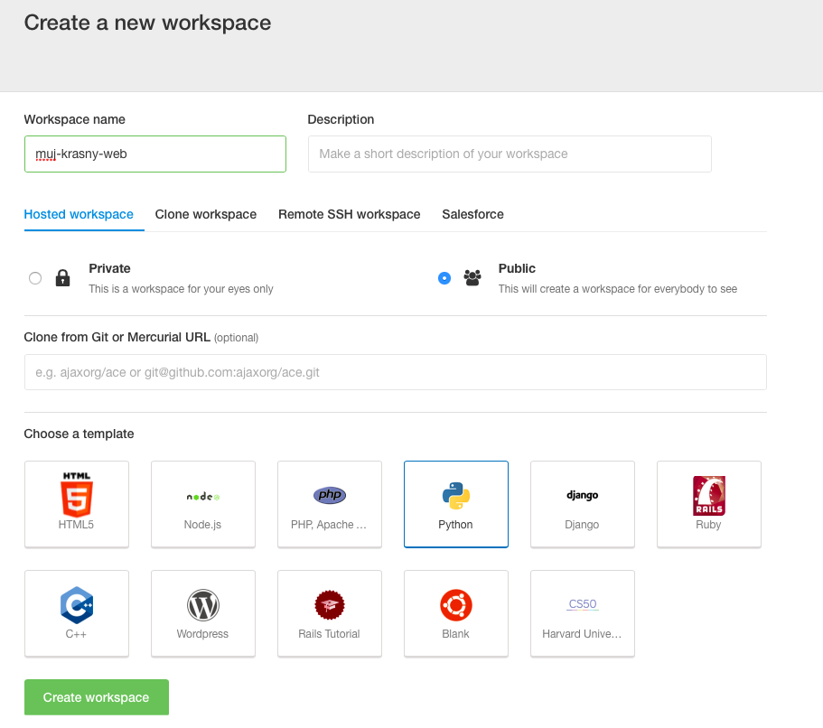

# Vývojové prostředí

Bež na https://c9.io/ a klikni na `Sign in`. Přihlaš se pomocí údajů, které jsem ti poslal mailem.

Klikni na `Create a new workspace`. Do pole jméno napiš své jméno a šablonu zvol Python.



### A teď do příkazové řádky

Vytvořit virtuální prostředí:

```
virtualenv --python=python3.4 myvenv
```

Aktivovat ho:

```
source myvenv/bin/activate
```

Instalovat Django:

```
pip install django
```

Vytvořit složku:

```
mkdir djangogirls
```

"Vlézt" do složky:

```
cd djangogirls
```
